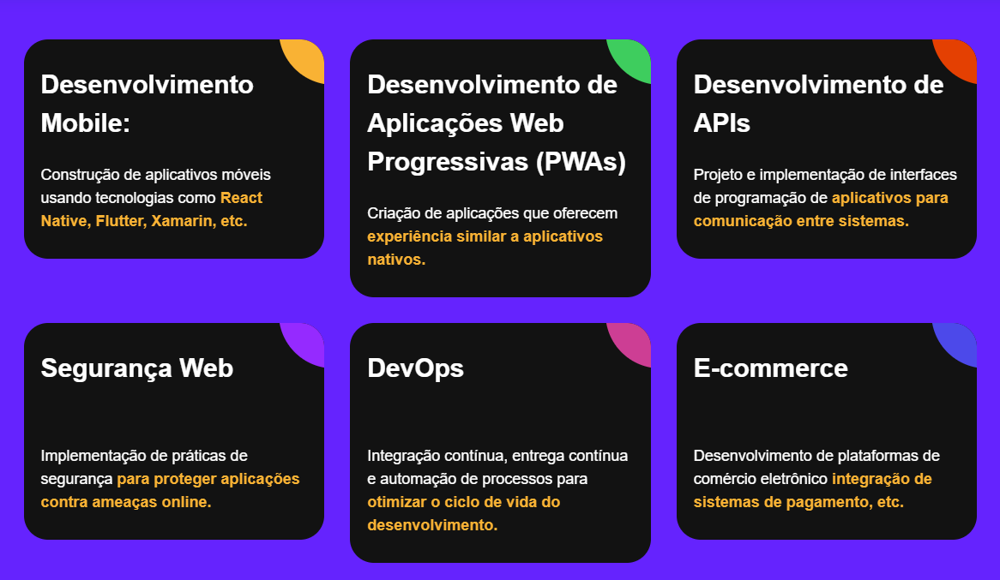

A pen created on Vinishireis

Title: Cards Projects Responsive
---
Responsive card projects developed with CSS and HTML are an excellent way to showcase content in an organized and visually appealing manner across different devices and screen sizes. These projects typically involve creating card-like containers that can adapt their layout and appearance based on the available screen space. Here's an overview of how such projects can be approached:

1. **HTML Structure**: The foundation of a responsive card project starts with the HTML structure. Each card is usually represented by a `
` element or another suitable container. Inside this container, content such as images, text, buttons, and other elements can be included to provide information or functionality.

2. **CSS Styling**: CSS is used to style the cards and make them visually appealing. This includes defining the size, shape, background, borders, and typography of the cards. CSS can also be used to add effects like shadows, hover effects, and transitions to enhance the user experience.

3. **Flexbox or Grid Layout**: Flexbox and CSS Grid are powerful layout tools that can be used to create responsive card layouts. Flexbox is particularly useful for arranging cards in a single row or column, while CSS Grid offers more flexibility for complex grid-based layouts.

4. **Media Queries**: Media queries allow developers to apply different styles based on the characteristics of the device or viewport. By using media queries, you can define specific CSS rules for different screen sizes, ensuring that the cards adapt smoothly to various devices, including desktops, tablets, and smartphones.

5. **Responsive Images**: When including images in the cards, it's essential to make them responsive as well. This can be achieved by setting the `max-width` property to `100%` to ensure that images scale proportionally with the card container.

6. **Accessibility**: Accessibility is an important consideration in web development. When designing card projects, make sure to use semantic HTML elements, descriptive alt text for images, and ensure that the content is navigable and readable for users of assistive technologies.

7. **Testing and Optimization**: Finally, it's crucial to test the responsive card project across different devices and screen sizes to ensure that it functions as intended. This may involve using browser developer tools, online emulators, or physical devices for testing. Optimization techniques such as minification and compression can also be applied to improve performance.

---

Overall, responsive card projects developed with CSS and HTML offer a versatile and user-friendly way to present content on the web, ensuring a consistent and enjoyable experience for users across various devices and platforms.